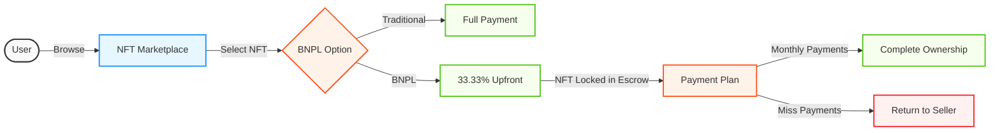

# 🔗 BNPL NFT System: The Future of NFT Financing 🔗

A revolutionary **Buy Now Pay Later (BNPL)** system for NFTs operating seamlessly across **Ethereum** and **Arbitrum** networks. Our platform empowers collectors to acquire premium NFTs with flexible payment options while ensuring seller security through our advanced escrow system.

## 📈 Market Opportunity
The Buy Now, Pay Later (BNPL) market is projected to grow from $560 billion in 2025 to $911.8 billion by 2030 at a CAGR of 10.2%, revolutionizing consumer purchasing behavior across industries.
Meanwhile, the NFT market is expected to surge from $61 billion in 2025 to $247 billion by 2029 at an impressive CAGR of 30.3%.
The Problem: Despite this explosive growth, the NFT ecosystem faces critical liquidity constraints:

- High entry barriers with steep upfront costs
- Limited accessibility for mainstream buyers
- Illiquid assets that lock up capital
- Creators struggle to monetize their work efficiently

**Our Solution**: By integrating BNPL into NFT payments, we're creating a new financial primitive that enables:

- Acquisition of premium NFTs with just 33.33% upfront payment
- Democratized access for millions of new participants
- Transformation of static NFTs into dynamic, tradeable instruments
- Accelerated liquidity and velocity throughout the ecosystem

This synergy between BNPL and NFTs creates an addressable market opportunity worth hundreds of billions and positions us at the forefront of the next wave of digital asset innovation.


## 🪄 Our Vision: Unlocking NFT Liquidity
The NFT market faces a critical bottleneck: prohibitive entry costs locking out millions of potential participants and billions in untapped value. Our BNPL protocol shatters these barriers by:

- 🌊 **Unleashing Liquidity**: Transforming static assets into dynamic, accessible instruments
- 🔓 **Democratizing Access**: Enabling participation with just 33.33% upfront payment
- 🚀 **Accelerating Adoption**: Creating a hypercharged cycle of innovation and value creation

"We're not just financing NFTs – we're rebuilding the infrastructure of digital ownership."


## 🎬 See It In Action
Watch our comprehensive project walkthrough:  
[🔗 BNPL NFT System Demo](https://youtu.be/rt04hzt1Dbs)

## 📊 Protocol Overview vs Traditional 




## ✨ Key Features

- **Multi-NFT Support**: Full compatibility with both ERC721 and ERC1155 NFT standards
- **Flexible Financing**: 3-month payment schedule with just 33.33% initial payment
- **Fair Penalty System**: Configurable late payment penalties (up to 10% per month)
- **Borrower Protection**: 3-day grace period for payments to accommodate unexpected delays
- **Seller Security**: Automatic default handling after 3 missed payments
- **Bulletproof Custody**: Advanced escrow system securely holds NFTs throughout the payment period

## 🔐 Smart Contracts

| Contract | Purpose |
|----------|---------|
| `NFTEscrow.sol` | Manages secure NFT custody during the active payment period |
| `LoanManager.sol` | Orchestrates loan creation, payment processing, and default handling |
| `MockNFT.sol` | Test implementations of ERC721 and ERC1155 NFTs for development |

## 🛠️ Technical Requirements

- Node.js v16+
- npm or yarn
- Ethereum wallet (MetaMask recommended)
- Testnet ETH for Ethereum and Arbitrum networks

## 🚀 Quick Start Guide

### Installation

```bash
# Clone the repository
git clone <repository-url>
cd bnpl-nft

# Install project dependencies
npm install

# Create and configure your environment variables
cp .env.example .env
# Add your private key and API keys to the .env file
```

### Frontend Setup

```bash
# Navigate to the frontend directory
cd frontend

# Install frontend dependencies
npm install

# Launch the development server
npm run dev
```

### Backend Service

```bash
# In a new terminal at the project root
node server.js
```

## 🔄 Multi-Chain Support

Our platform supports NFTs from multiple blockchains, allowing users to finance digital assets regardless of their native network:

- **Ethereum**: Use our BNPL system with any Ethereum-based NFTs
- **Arbitrum**: Seamlessly finance NFTs minted on Arbitrum

This cross-chain compatibility means creators and collectors can use our platform regardless of which blockchain ecosystem they prefer, maximizing market reach and liquidity options.


## 📦 Decentralized Storage with Pinata

Our platform leverages Pinata's IPFS pinning service to ensure NFT metadata remains permanently accessible and truly decentralized:

- **Immutable Metadata**: All NFT metadata is pinned to IPFS, ensuring content cannot be altered after creation
- **Persistent Availability**: Pinata's dedicated IPFS nodes keep your NFT metadata available even if original sources go offline
- **Content Addressing**: IPFS CIDs (Content Identifiers) guarantee the exact data referenced is what is received

## 🧠 How It Works

1. **Buyer** selects an NFT and initiates the BNPL process
2. **System** calculates payment schedule based on NFT price
3. **Buyer** makes initial payment (33.33%)
4. **Smart Contract** secures the NFT in escrow
5. **Buyer** completes remaining payments over 3 months
6. Upon final payment, **Smart Contract** releases the NFT to the buyer

## 💻 Developer Flow

- Create an NFT: Use our mock contract to quickly create NFT
- Configure terms: Set payment schedule and default parameters
- Test user journey: Simulate payments and defaults using our test suite
- Deploy cross-chain: Launch on Ethereum and Arbitrum testnets

## 🔬 Roadmap

- Q2 2025: Mainnet beta launch
- Q3 2025: Integration with major NFT marketplaces
- Q4 2025: DAO governance implementation

## 🛡️ Group 5

| Name | Role |
|------|------|
| DARRYL NG BING BING | 2303161 |
| JULIAN TEO | 2303039 |
| TAMO CHOLO RAFAEL TANDOC | 2302944 |
| BRENDAN EDWARD RAJ | 2302986 |
| NG SHU YI | 2302940 |

---

Built with ❤️ by Team BNPL NFT
